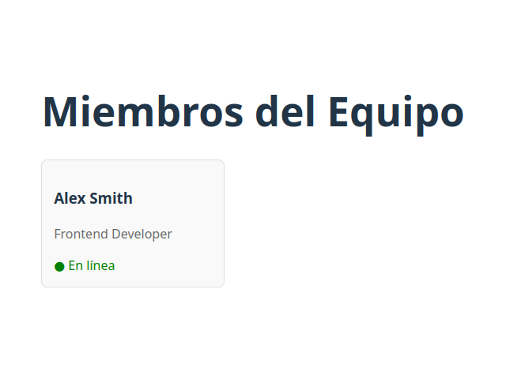

# 👥 Exercise 03: The User Card

## Descripción
En este ejercicio aprenderás a modularizar tu código. Tu misión es lograr que la información de un usuario pase desde un componente "Padre" (`App.jsx`) hacia un componente "Hijo" (`UserCard.jsx`) utilizando propiedades (Props).

## ¿Qué conceptos vas a practicar?
* **Props**: Pasar datos entre componentes como si fueran argumentos de una función.
* **Destructuring**: Extraer valores de las props de forma limpia en los argumentos del componente.
* **Reutilización**: Entender cómo un mismo componente puede mostrar distintos datos.

## Documentación Oficial Recomendada
👉 **[Passing Props to a Component](https://react.dev/learn/passing-props-to-a-component)**

