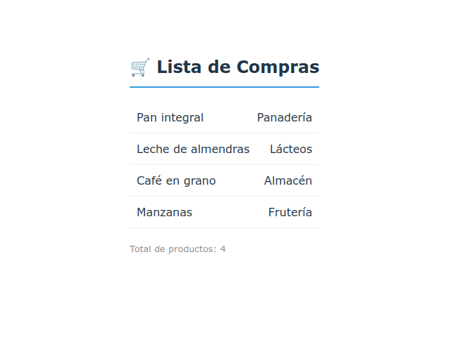

# 🛒 Exercise 04: Shopping List

## Descripción
La mayoría de las aplicaciones muestran colecciones de datos. En este ejercicio, recibirás un array de productos y deberás transformarlos en una lista visual de elementos `<li>` de forma automática.

## ¿Qué conceptos vas a practicar?
* **Array Mapping**: Usar `.map()` para transformar datos en elementos visuales (JSX).
* **Keys**: Aprender por qué React necesita una identidad única para cada elemento de la lista.
* **Renderizado de Arrays**: Mostrar múltiples componentes a partir de una sola variable de estado.

## Documentación Oficial Recomendada
👉 **[Rendering Lists](https://react.dev/learn/rendering-lists)**

