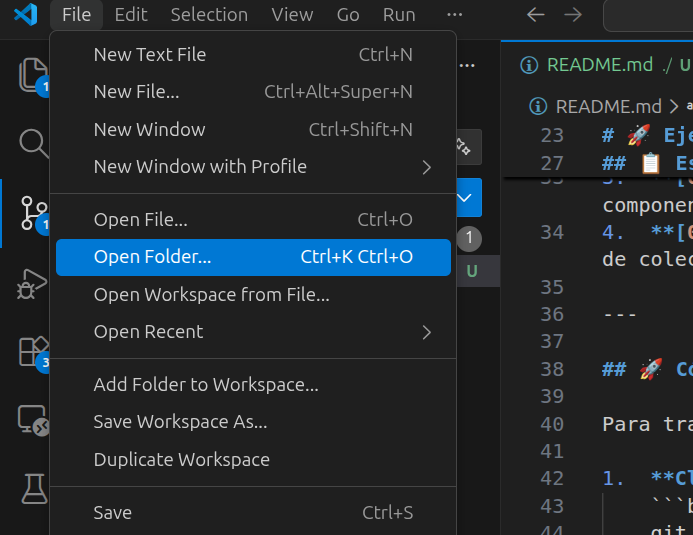
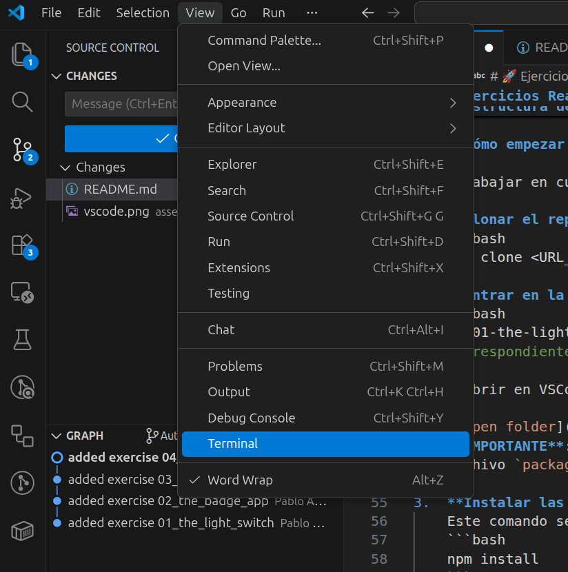
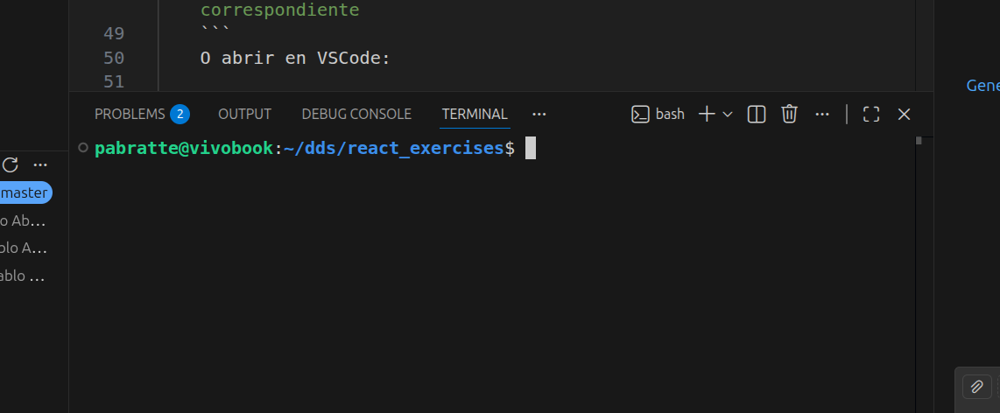

# 🚀 Ejercicios React

Repositorio de ejercicios prácticos de React para practicar desde los conceptos más básicos hasta la composición de interfaces dinámicas y reutilizables.

## 📋 Estructura del Repositorio

El repositorio está dividido en 4 niveles de dificultad progresiva:

1.  **[01-the-light-switch](./01-the-light-switch)**: Introducción al estado (`useState`) y manejo de eventos.
2.  **[02-the-badge-app](./02-the-badge-app)**: Captura de datos del usuario mediante inputs controlados.
3.  **[03-the-user-card](./03-the-user-card)**: Comunicación entre componentes mediante el paso de `Props`.
4.  **[04-shopping-list](./04-shopping-list)**: Renderizado dinámico de colecciones de datos usando `.map()`.

---

## 🚀 Cómo empezar

Para trabajar en cualquiera de los ejercicios, sigue estos pasos:

1.  **Clonar el repositorio:**
    ```bash
    git clone https://github.com/pabratte/react-exercises.git
    ```
2.  **Entrar en la carpeta del ejercicio:**
    ```bash
    cd 01-the-light-switch  # O la carpeta del ejercicio correspondiente
    ```
    O abrir en VSCode:

    
    **IMPORTANTE**: abrir la carpeta del proyecto, la que contiene el archivo `package.json`

3.  **Instalar las dependencias:**
    Este comando se debe **ejecutar una única** vez por proyecto.
    ```bash
    npm install
    ```
    Se puede hacer en la terminal de VSCode:
    

    

4.  **Iniciar el entorno de desarrollo:**
    ```bash
    npm run dev
    ```
5.  **¡A programar!** Abre el proyecto en tu editor, busca el archivo principal (normalmente `App.jsx`) y completa los retos marcados en los comentarios.

---

## 💡 Metodología de trabajo

Cada ejercicio viene con un código base que ya es funcional pero está incompleto.